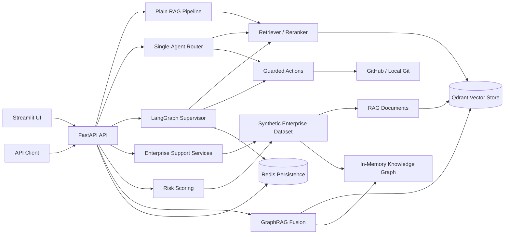

# Enterprise Support Intelligence Copilot

A multi-source AI copilot for customer support, internal knowledge retrieval, ticket triage, CRM intelligence, GraphRAG, and risk/anomaly detection.
Built as an AI Engineer portfolio project with FastAPI, Streamlit, Qdrant, Redis, LangGraph, synthetic enterprise support data, evaluation scripts, Docker, and tests.

## Problem

Support teams rarely have one clean source of truth. A single customer escalation can require CRM context, ticket history, knowledge-base policy, engineering issue status, service ownership, incident risk, and prior similar cases.

This project demonstrates how an enterprise support copilot can unify those signals into retrieval, automation, graph reasoning, and evaluation workflows while keeping data synthetic and local-demo friendly.

## Key Features

- **FastAPI backend** with health/readiness checks, RAG chat, agent chat, enterprise support automation, GraphRAG evidence retrieval, and risk scoring endpoints.
- **Streamlit UI** for local chat exploration and source/debug inspection.
- **RAG with Qdrant** for document indexing and retrieval.
- **Redis persistence** for sessions, pending actions, action records, and LangGraph checkpoints, with in-memory fallback settings for local tests.
- **LangGraph multi-agent orchestration** for supervisor-style routing across support/retrieval/action workflows.
- **Guarded write actions** for GitHub issue/repository actions and local git commits with authorization, confirmation, and idempotency controls.
- **Synthetic enterprise support dataset** with CRM records, accounts, products, tickets, ticket messages, resolutions, knowledge-base policies, service catalog entries, GitHub issues, and risk events.
- **CRM and support automation endpoints** for customer summaries, ticket triage, suggested replies, SLA checks, and customer risk scoring.
- **Knowledge Graph and GraphRAG layer** implemented in memory. `/enterprise/ask` returns fused vector/graph evidence and a placeholder answer; it does not yet call an LLM for final generation.
- **Risk/anomaly scoring** implemented as a deterministic heuristic baseline over tickets and risk events. `scikit-learn` is not currently a dependency, so IsolationForest is not enabled.
- **Evaluation scripts** for retrieval, answer quality, and enterprise support evidence coverage.
- **Docker support** for local Qdrant, Redis, API, and UI services.

## Architecture



## Data Model Summary

The enterprise dataset lives under `data/sample_enterprise_support/` and is synthetic only.

- `crm/`: customers, accounts, products
- `support/`: tickets, ticket messages, ticket resolutions
- `knowledge_base/`: SLA, access, refund, API timeout, login, security, incident, enterprise support, customer risk, and retention policies
- `engineering/`: service catalog and synthetic GitHub issues
- `risk/`: customer/ticket/service risk events

Stable IDs connect the data: `customer_id`, `account_id`, `product_id`, `ticket_id`, `service_id`, `policy_id`, and `risk_event_id`.

Design docs:
- [docs/data_model.md](./docs/data_model.md)
- [docs/use_cases.md](./docs/use_cases.md)
- [docs/kg_schema.md](./docs/kg_schema.md)

## Folder Structure

```text
.
|-- src/
|   |-- api/              # FastAPI app and endpoints
|   |-- agent/            # Agent routing, tools, memory, guarded actions
|   |-- agent/graph/      # LangGraph supervisor and subgraphs
|   |-- core/             # Settings, auth, logging, observability, schemas
|   |-- data/             # Enterprise support loaders, document builders, services
|   |-- integrations/     # GitHub App and local git clients
|   |-- kg/               # In-memory Knowledge Graph schema, builder, store, retriever
|   |-- ml/               # Risk feature extraction and heuristic anomaly scoring
|   |-- persistence/      # Redis and memory-backed persistence
|   |-- rag/              # Chunking, ingestion, indexing, retrieval, GraphRAG, generation
|   |-- ui/               # Streamlit UI
|-- data/
|   |-- sample_enterprise_support/
|-- data_source/          # Original local demo/evaluation source snapshot
|-- docs/
|-- eval/
|-- scripts/
|-- tests/
|-- docker-compose.yml
|-- Dockerfile
|-- pyproject.toml
```

## Setup

Supported Python: `>=3.10,<3.12`.

### Windows PowerShell

```powershell
py -3.11 -m venv .venv
.venv\Scripts\Activate.ps1
python scripts/dev.py install
Copy-Item .env.example .env
docker compose up -d qdrant redis
```

### Linux/macOS

```bash
python3.11 -m venv .venv
source .venv/bin/activate
python scripts/dev.py install
cp .env.example .env
docker compose up -d qdrant redis
```

Run the backend and UI:

```bash
python scripts/dev.py run-api
python scripts/dev.py run-ui
```

Default local URLs:

- API: `http://127.0.0.1:8000`
- UI: `http://127.0.0.1:8501`
- Qdrant: `http://127.0.0.1:6333`
- Redis: `redis://localhost:6379/0`

## Ingestion

### Original GitHub/Internal Knowledge Ingestion

The original ingestion path prepares documents from `data_source/` and rebuilds the configured Qdrant collection.

```bash
python scripts/dev.py ingest-data
```

Equivalent direct command:

```bash
python scripts/ingest_data.py
```

Qdrant must be running before ingestion.

### Enterprise Support Ingestion

Preview the enterprise support documents without writing to Qdrant:

```bash
python scripts/ingest_enterprise_support_data.py --dry-run
```

Ingest into a separate Qdrant collection:

```bash
python scripts/ingest_enterprise_support_data.py --collection-name enterprise_support_copilot_qdrant
```

Run the API against that collection:

```bash
QDRANT_COLLECTION_NAME=enterprise_support_copilot_qdrant python scripts/dev.py run-api
```

Windows PowerShell:

```powershell
$env:QDRANT_COLLECTION_NAME = "enterprise_support_copilot_qdrant"
python scripts/dev.py run-api
```

## API Examples

Health:

```bash
curl http://127.0.0.1:8000/health
```

Readiness:

```bash
curl -i http://127.0.0.1:8000/ready
```

Customer summary:

```bash
curl -X POST http://127.0.0.1:8000/crm/customer-summary \
  -H "Content-Type: application/json" \
  -d '{"customer_id": "cust_001"}'
```

Ticket triage:

```bash
curl -X POST http://127.0.0.1:8000/support/ticket-triage \
  -H "Content-Type: application/json" \
  -d '{"ticket_id": "tkt_001"}'
```

Suggested support reply:

```bash
curl -X POST http://127.0.0.1:8000/support/suggest-reply \
  -H "Content-Type: application/json" \
  -d '{"ticket_id": "tkt_001"}'
```

Customer risk score:

```bash
curl -X POST http://127.0.0.1:8000/risk/customer-score \
  -H "Content-Type: application/json" \
  -d '{"customer_id": "cust_009"}'
```

GraphRAG evidence retrieval:

```bash
curl -X POST http://127.0.0.1:8000/enterprise/ask \
  -H "Content-Type: application/json" \
  -d '{
    "question": "Why is the API timeout risky for Northstar?",
    "top_k": 5,
    "graph_depth": 2
  }'
```

`/enterprise/ask` currently returns fused evidence and a placeholder answer. Final LLM answer generation for this endpoint is intentionally not wired in yet.

## Evaluation

Retrieval benchmark:

```bash
python scripts/dev.py benchmark-retrieval
```

Answer-quality benchmark:

```bash
python scripts/dev.py benchmark-answers
```

Enterprise support evaluation without Qdrant:

```bash
python eval/evaluate_enterprise_support.py --dry-run
```

Enterprise support dry-run uses local lexical retrieval plus the in-memory KG. It evaluates Recall@5 for expected entity IDs, source-type hit rate, metadata groundedness proxy, and missing-information handling proxy.

Current dry-run snapshot:

| Mode | Recall@5 | Source Type Hit Rate | Groundedness Proxy | Missing-Info Proxy |
| --- | ---: | ---: | ---: | ---: |
| Local lexical + KG dry-run | 0.6788 | 1.0000 | 1.0000 | 1.0000 |

Qdrant GraphRAG evaluation requires enterprise ingestion first:

```bash
python scripts/ingest_enterprise_support_data.py --collection-name enterprise_support_copilot_qdrant
QDRANT_COLLECTION_NAME=enterprise_support_copilot_qdrant python eval/evaluate_enterprise_support.py
```

## Testing

Run the default test suite:

```bash
python scripts/dev.py run-tests
```

Run the CI-equivalent unit subset:

```bash
python -m pytest -m "not integration" -q
```

Run lint and format checks:

```bash
python -m ruff check .
python -m ruff format --check .
```

The GitHub Actions CI runs fast changed-file lint/format checks and unit tests on Python `3.10` and `3.11`.

## Production Notes

Current limitations:

- All enterprise customer/support data is synthetic.
- `/enterprise/ask` does not yet generate a final LLM answer; it returns placeholder text plus vector/graph evidence.
- Risk scoring is a deterministic heuristic baseline, not a trained anomaly model.
- The in-memory Knowledge Graph is suitable for demos and tests, not large-scale graph operations.
- Local auth is header-based and intended as a replaceable boundary, not enterprise SSO.
- Evaluation groundedness is metadata-based; it is not a full factuality judge.

For real deployment:

- Replace synthetic data with governed CRM, support, incident, KB, and engineering connectors.
- Add PII controls, tenant isolation, retention policies, audit logging, and human approval workflows.
- Use production auth/SSO, RBAC, secrets management, and network controls.
- Add background ingestion jobs, schema migrations, monitoring, tracing, and alerting.
- Calibrate risk models with historical outcomes and evaluate them against labeled incidents/churn/escalation data.
- Replace the in-memory KG with a persistent graph store if graph volume or query complexity grows.
- Add LLM answer generation for GraphRAG with citations, refusal behavior, and answer-quality evaluation.

## Resume Bullets

- Built an enterprise support AI copilot with FastAPI, Streamlit, Qdrant RAG, Redis persistence, LangGraph orchestration, guarded GitHub/local git actions, Docker, CI, and tests.
- Designed a synthetic multi-source support dataset spanning CRM records, accounts, products, tickets, ticket messages, resolutions, policies, services, GitHub issues, and risk events.
- Implemented CRM/support automation APIs for customer summaries, ticket triage, customer-safe reply drafting, SLA checks, and explainable customer risk scoring.
- Added an in-memory Knowledge Graph, GraphRAG evidence fusion, and enterprise evaluation suite measuring Recall@5, source-type coverage, groundedness proxy, and missing-information handling.

## Safety

This repository is designed for portfolio demonstration with synthetic data only. Do not commit private customer data, secrets, tokens, API keys, `.env`, GitHub private keys, or local credential files.
