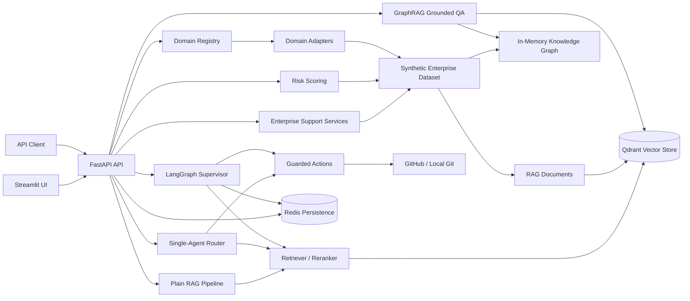

# Enterprise Support Intelligence Copilot

A multi-source AI copilot for customer support, internal knowledge retrieval, ticket triage, CRM intelligence, GraphRAG, and risk/anomaly detection.
Built as a reusable Enterprise AI Copilot base with FastAPI, Streamlit, Qdrant, Redis, LangGraph, domain adapters, synthetic enterprise support data, evaluation scripts, Docker, and tests.

## Problem

Support teams rarely have one clean source of truth. A single customer escalation can require CRM context, ticket history, knowledge-base policy, engineering issue status, service ownership, incident risk, and prior similar cases.

This project demonstrates how an enterprise support copilot can unify those signals into retrieval, automation, graph reasoning, and evaluation workflows while keeping data synthetic and local-demo friendly. The current implemented domain is `enterprise_support`; the core infrastructure is being organized so future domains can plug in through a domain adapter instead of rewriting ingestion, validation, evaluation, and API foundations.

## Key Features

- **FastAPI backend** with health/readiness checks, RAG chat, agent chat, enterprise support automation, grounded GraphRAG QA, and risk scoring endpoints.
- **Streamlit UI** for local chat exploration and source/debug inspection.
- **RAG with Qdrant** for document indexing and retrieval, including enterprise hybrid retrieval with dense, sparse/lexical, metadata-filtered fusion.
- **Redis persistence** for sessions, pending actions, action records, and LangGraph checkpoints, with in-memory fallback settings for local tests.
- **LangGraph multi-agent orchestration** for supervisor-style routing across support/retrieval/action workflows.
- **Guarded write actions** for GitHub issue/repository actions and local git commits with authorization, confirmation, and idempotency controls.
- **Synthetic enterprise support dataset** with CRM records, accounts, products, tickets, ticket messages, resolutions, knowledge-base policies, service catalog entries, GitHub issues, and risk events.
- **Domain adapter layer** for reusable copilot domains. `enterprise_support` and `banking_fraud` wrap domain loading, validation, RAG document building, KG building, prompts, and evaluation queries.
- **CRM and support automation endpoints** for customer summaries, ticket triage, suggested replies, SLA checks, and customer risk scoring.
- **Knowledge Graph and GraphRAG layer** implemented in memory. `/enterprise/ask` fuses vector and graph context, scores evidence sufficiency, and returns a grounded deterministic answer, citations, missing-information notes, confidence, and the underlying evidence.
- **Risk/anomaly scoring** implemented as a deterministic heuristic baseline over tickets and risk events, with an optional unsupervised IsolationForest baseline when `scikit-learn` is installed locally.
- **Evaluation scripts** for retrieval, answer quality, and enterprise support evidence coverage.
- **Docker support** for local Qdrant, Redis, API, and UI services.

## Architecture



## Data Model Summary

The enterprise dataset lives under `data/sample_enterprise_support/` and is synthetic only.

- `crm/`: customers, accounts, products
- `support/`: tickets, ticket messages, ticket resolutions
- `knowledge_base/`: SLA, access, refund, API timeout, login, security, incident, enterprise support, customer risk, and retention policies
- `engineering/`: service catalog and synthetic GitHub issues
- `risk/`: customer/ticket/service risk events

Stable IDs connect the data: `customer_id`, `account_id`, `product_id`, `ticket_id`, `service_id`, `policy_id`, and `risk_event_id`.

The banking fraud domain pack lives under `data/sample_banking_fraud/` and is also synthetic only. It includes customers, accounts, transactions, merchants, fraud alerts, AML cases, and policy documents for AML, card fraud, and account takeover workflows.

Design docs:
- [docs/data_model.md](./docs/data_model.md)
- [docs/use_cases.md](./docs/use_cases.md)
- [docs/kg_schema.md](./docs/kg_schema.md)

## Folder Structure

```text
.
|-- src/
|   |-- api/              # FastAPI app and endpoints
|   |-- agent/            # Agent routing, tools, memory, guarded actions
|   |-- agent/graph/      # LangGraph supervisor and subgraphs
|   |-- core/             # Settings, auth, logging, observability, schemas
|   |-- data/             # Enterprise support loaders, document builders, services
|   |-- domains/          # Domain adapter interface, registry, and enterprise_support adapter
|   |-- integrations/     # GitHub App and local git clients
|   |-- kg/               # In-memory Knowledge Graph schema, builder, store, retriever
|   |-- ml/               # Risk feature extraction, heuristic scoring, optional ML anomaly scoring
|   |-- persistence/      # Redis and memory-backed persistence
|   |-- rag/              # Chunking, ingestion, indexing, retrieval, GraphRAG, generation
|   |-- ui/               # Streamlit UI
|-- data/
|   |-- sample_enterprise_support/
|   |-- sample_banking_fraud/
|-- data_source/          # Original local demo/evaluation source snapshot
|-- docs/
|-- eval/
|-- scripts/
|-- tests/
|-- docker-compose.yml
|-- Dockerfile
|-- pyproject.toml
```

## Domain Adapter Layer

The reusable copilot boundary is `src/domains/`. A domain adapter exposes the domain-specific pieces needed by shared infrastructure:

- `name`
- `default_data_dir`
- `default_collection_name`
- `load_dataset(data_dir)`
- `validate_dataset(dataset)`
- `build_documents(dataset)`
- `build_graph(dataset)`
- `get_eval_queries()`
- `get_prompt_templates()`

The current registered adapters are:

- `enterprise_support`: CRM/customer support, tickets, KB policies, services, GitHub issues, and risk events.
- `banking_fraud`: synthetic banking customers, accounts, transactions, merchants, fraud alerts, AML cases, and fraud/AML policies.

Generic domain commands:

```bash
python scripts/validate_domain_data.py --domain enterprise_support
python scripts/ingest_domain.py --domain enterprise_support --dry-run
python eval/evaluate_domain.py --domain enterprise_support --dry-run

python scripts/validate_domain_data.py --domain banking_fraud
python scripts/ingest_domain.py --domain banking_fraud --dry-run
python eval/evaluate_domain.py --domain banking_fraud --dry-run
```

To add a new domain, create `src/domains/<domain_name>/adapter.py`, implement the adapter interface, add domain-specific loader/document/KG/prompt modules as needed, and register the adapter in `src/domains/registry.py`. Keep IDs stable, return RAG documents with `id`, `text`, and `metadata`, and add dry-run validation/evaluation tests before wiring any domain-specific API behavior.

### Banking Fraud Example

The `banking_fraud` adapter demonstrates how the same copilot base can support a different enterprise domain without changing FastAPI or vector-store infrastructure. Example questions include:

- "Explain fraud alert `bf_alert_001` for customer `bf_cust_001`."
- "Summarize AML case `bf_case_001` and the linked suspicious wire alerts."
- "What account takeover policy applies to a foreign device attempting a high-value wire?"

## Setup

Supported Python: `>=3.10,<3.12`.

### Windows PowerShell

```powershell
py -3.11 -m venv .venv
.venv\Scripts\Activate.ps1
python scripts/dev.py install
Copy-Item .env.example .env
docker compose up -d qdrant redis
```

### Linux/macOS

```bash
python3.11 -m venv .venv
source .venv/bin/activate
python scripts/dev.py install
cp .env.example .env
docker compose up -d qdrant redis
```

Run the backend and UI:

```bash
python scripts/dev.py run-api
python scripts/dev.py run-ui
```

Default local URLs:

- API: `http://127.0.0.1:8000`
- UI: `http://127.0.0.1:8501`
- Qdrant: `http://127.0.0.1:6333`
- Redis: `redis://localhost:6379/0`

## Ingestion

### Original GitHub/Internal Knowledge Ingestion

The original ingestion path prepares documents from `data_source/` and rebuilds the configured Qdrant collection.

```bash
python scripts/dev.py ingest-data
```

Equivalent direct command:

```bash
python scripts/ingest_data.py
```

Qdrant must be running before ingestion.

### Enterprise Support Ingestion

Generic domain dry-run:

```bash
python scripts/ingest_domain.py --domain enterprise_support --dry-run
```

Preview the enterprise support documents without writing to Qdrant:

```bash
python scripts/ingest_enterprise_support_data.py --dry-run
```

Ingest into a separate Qdrant collection:

```bash
python scripts/ingest_enterprise_support_data.py --collection-name enterprise_support_copilot_qdrant
```

Run the API against that collection:

```bash
QDRANT_COLLECTION_NAME=enterprise_support_copilot_qdrant python scripts/dev.py run-api
```

Windows PowerShell:

```powershell
$env:QDRANT_COLLECTION_NAME = "enterprise_support_copilot_qdrant"
python scripts/dev.py run-api
```

## Hybrid Enterprise Retrieval

Enterprise GraphRAG retrieval uses a conservative hybrid layer:

- Dense semantic search against Qdrant when the enterprise collection is available.
- Sparse Qdrant search when the collection has sparse vectors.
- Local lexical fallback over `data/sample_enterprise_support/` when sparse Qdrant is unavailable or empty.
- Reciprocal-rank fusion across dense and sparse/lexical candidates.
- Optional metadata filters: `source_type`, `customer_id`, `ticket_id`, `service_id`, and `product_id`.
- Debug metadata on retrieved documents: `dense_score`, `sparse_score`, `lexical_score`, `fused_score`, and matched metadata.

Hybrid search helps with support queries that mix natural language with exact IDs or operational terms, for example `cust_001 SLA breach`, `tkt_001 API timeout`, or `svc_api_gateway owner`.

If an older Qdrant collection was created without sparse vectors, `/enterprise/ask` still works through dense retrieval plus local lexical fallback. Rebuild or re-ingest the enterprise collection only if you want Qdrant-native sparse search:

```bash
python scripts/ingest_enterprise_support_data.py --collection-name enterprise_support_copilot_qdrant
```

Before final answer generation, `/enterprise/ask` also scores evidence sufficiency. The deterministic score considers evidence count, source diversity, exact entity matches, critical source coverage, contradiction signals, and freshness metadata. Low-sufficiency evidence produces a partial answer with explicit missing information instead of unsupported claims.

### Controlled Agentic Retrieval

`/enterprise/ask` can optionally use a bounded, deterministic agentic retrieval workflow:

- Classifies intent as `customer_summary`, `ticket_triage`, `policy_lookup`, `service_owner`, `risk_explanation`, or `general`.
- Chooses retrieval filters from the intent and any explicit request filters.
- Runs the existing vector and Knowledge Graph retrieval path.
- Scores evidence sufficiency.
- If sufficiency is low, rewrites the query once with rule-based expansion and retrieves again.
- Stops after at most two retrieval attempts.

Enable it with:

```json
{
  "question": "Why is tkt_001 risky?",
  "use_agentic_retrieval": true,
  "debug": true
}
```

When enabled, the response includes `metadata.agentic_trace` with intent, attempts, filters used, sufficiency before/after, and stop reason. This workflow performs no autonomous write actions and does not call external systems beyond the existing read-only retrieval path.

## Observability

The API middleware propagates `X-Request-ID` into response headers, structured logs, and in-memory traces. Enterprise GraphRAG logs stage timings without logging the full user question:

- dataset/context load
- vector retrieval
- graph retrieval
- vector/graph fusion
- evidence sufficiency scoring
- grounded answer generation
- total `/enterprise/ask` latency

`/enterprise/ask` accepts `"debug": true` to include `metadata.debug` with `source_type_counts`, `evidence_count`, top evidence IDs, latency breakdown, hybrid retrieval debug, and evidence sufficiency details.

The lightweight `/metrics` endpoint returns the in-memory observability snapshot, including counters/histograms such as `enterprise_ask_requests_total`, `enterprise_ask_errors_total`, `enterprise_ask_latency_ms`, and `enterprise_low_confidence_total`. No LangSmith or paid tracing service is required.

## Risk Scoring

`/risk/customer-score` defaults to a deterministic heuristic baseline. It extracts recent customer-level support and risk signals from the synthetic dataset, including ticket volume, critical tickets, escalations, failed-login/auth issues, API timeouts, refund/billing signals, and negative risk events.

An optional unsupervised ML baseline is available through `mode: "ml"`. The ML path trains a small `IsolationForest` over the synthetic customer feature table if `scikit-learn` is installed in the local environment. `scikit-learn` is intentionally not a required dependency; when it is unavailable, ML mode falls back to the heuristic scorer and returns the fallback reason in `model_metadata`.

The API currently trains this optional baseline in memory from the small synthetic cohort. The CLI artifact below is useful for local inspection and future extension; it is not required for the API endpoint.

Preview the feature table without training:

```bash
python scripts/train_risk_model.py --dry-run
```

Train a local artifact if `scikit-learn` is installed:

```bash
python scripts/train_risk_model.py --output-path artifacts/risk/isolation_forest.pkl
```

Limitations: the current ML baseline is unsupervised, trained only on the small synthetic dataset, and should be treated as a portfolio/demo baseline rather than a production risk model. A real deployment would need labeled outcomes, drift checks, calibration, monitoring, and governance around customer-impacting decisions.

## API Examples

Health:

```bash
curl http://127.0.0.1:8000/health
```

Readiness:

```bash
curl -i http://127.0.0.1:8000/ready
```

Customer summary:

```bash
curl -X POST http://127.0.0.1:8000/crm/customer-summary \
  -H "Content-Type: application/json" \
  -d '{"customer_id": "cust_001"}'
```

Ticket triage:

```bash
curl -X POST http://127.0.0.1:8000/support/ticket-triage \
  -H "Content-Type: application/json" \
  -d '{"ticket_id": "tkt_001"}'
```

Suggested support reply:

```bash
curl -X POST http://127.0.0.1:8000/support/suggest-reply \
  -H "Content-Type: application/json" \
  -d '{"ticket_id": "tkt_001"}'
```

Customer risk score:

```bash
curl -X POST http://127.0.0.1:8000/risk/customer-score \
  -H "Content-Type: application/json" \
  -d '{"customer_id": "cust_009", "mode": "heuristic"}'
```

Optional ML risk mode with heuristic fallback when `scikit-learn` is unavailable:

```bash
curl -X POST http://127.0.0.1:8000/risk/customer-score \
  -H "Content-Type: application/json" \
  -d '{"customer_id": "cust_009", "mode": "ml"}'
```

GraphRAG grounded QA:

```bash
curl -X POST http://127.0.0.1:8000/enterprise/ask \
  -H "Content-Type: application/json" \
  -d '{
    "question": "Why is the API timeout risky for Northstar?",
    "debug": true,
    "top_k": 5,
    "graph_depth": 2,
    "customer_id": "cust_001",
    "source_type": "ticket",
    "use_agentic_retrieval": true
  }'
```

`/enterprise/ask` uses retrieved vector and graph evidence to build a deterministic grounded answer. It returns citations with `source_type`, `entity_id`, `title`, and snippets, plus `confidence`, `evidence_sufficiency`, and missing-information notes when evidence is insufficient. It does not call a paid or external LLM by default.

## Evaluation

Retrieval benchmark:

```bash
python scripts/dev.py benchmark-retrieval
```

Answer-quality benchmark:

```bash
python scripts/dev.py benchmark-answers
```

Enterprise support evaluation without Qdrant:

```bash
python eval/evaluate_domain.py --domain enterprise_support --dry-run
python eval/evaluate_enterprise_support.py --dry-run
```

Enterprise support dry-run uses local lexical retrieval plus the in-memory KG. It evaluates Recall@5 for expected entity IDs, source-type hit rate, metadata groundedness proxy, and missing-information handling proxy.

Current dry-run snapshot:

| Mode | Recall@5 | Source Type Hit Rate | Groundedness Proxy | Missing-Info Proxy |
| --- | ---: | ---: | ---: | ---: |
| Local lexical + KG dry-run | 0.6788 | 1.0000 | 1.0000 | 1.0000 |

### AI Quality Gate

Run the enterprise retrieval quality gate locally:

```bash
make eval-gate
```

Equivalent direct command:

```bash
python eval/evaluate_enterprise_support.py --dry-run --fail-under
```

Default thresholds:

- Recall@5 must be at least `0.65`.
- Source type hit rate must be at least `0.90`.

The dry-run gate uses local lexical retrieval plus the in-memory Knowledge Graph, so it does not require Qdrant or paid APIs. Use custom thresholds when needed:

```bash
python eval/evaluate_enterprise_support.py --dry-run \
  --min-recall-at-5 0.70 \
  --min-source-hit-rate 0.95
```

Write machine-readable output:

```bash
python eval/evaluate_enterprise_support.py --dry-run --fail-under --json-output eval/runs/latest_enterprise_gate.json
```

Interpretation: gate failures mean the retrieved evidence no longer meets the minimum expected coverage for the synthetic enterprise benchmark. Inspect weak cases in the summary, then check whether the regression came from data changes, retrieval filters, lexical scoring, KG traversal, or expected labels.

Qdrant GraphRAG evaluation requires enterprise ingestion first:

```bash
python scripts/ingest_enterprise_support_data.py --collection-name enterprise_support_copilot_qdrant
QDRANT_COLLECTION_NAME=enterprise_support_copilot_qdrant python eval/evaluate_enterprise_support.py
```

## Testing

Run the default test suite:

```bash
python scripts/dev.py run-tests
```

Run the CI-equivalent unit subset:

```bash
python -m pytest -m "not integration" -q
```

Run lint and format checks:

```bash
python -m ruff check .
python -m ruff format --check .
```

The GitHub Actions CI runs fast changed-file lint/format checks and unit tests on Python `3.10` and `3.11`.

## Production Notes

Current limitations:

- All enterprise customer/support data is synthetic.
- `/enterprise/ask` uses deterministic grounded answer generation and evidence sufficiency scoring rather than a free-form LLM by default.
- Risk scoring defaults to a deterministic heuristic baseline; the optional IsolationForest mode is an unsupervised demo baseline, not a calibrated production model.
- The in-memory Knowledge Graph is suitable for demos and tests, not large-scale graph operations.
- Local auth is header-based and intended as a replaceable boundary, not enterprise SSO.
- Evaluation groundedness is metadata-based; it is not a full factuality judge.

For real deployment:

- Replace synthetic data with governed CRM, support, incident, KB, and engineering connectors.
- Add PII controls, tenant isolation, retention policies, audit logging, and human approval workflows.
- Use production auth/SSO, RBAC, secrets management, and network controls.
- Add background ingestion jobs, schema migrations, monitoring, tracing, and alerting.
- Calibrate risk models with historical outcomes and evaluate them against labeled incidents/churn/escalation data before using them for operational decisions.
- Replace the in-memory KG with a persistent graph store if graph volume or query complexity grows.
- Optionally add configurable local or hosted LLM generation for GraphRAG while preserving citations, refusal behavior, and answer-quality evaluation.

## Resume Bullets

- Built an enterprise support AI copilot with FastAPI, Streamlit, Qdrant RAG, Redis persistence, LangGraph orchestration, guarded GitHub/local git actions, Docker, CI, and tests.
- Designed a synthetic multi-source support dataset spanning CRM records, accounts, products, tickets, ticket messages, resolutions, policies, services, GitHub issues, and risk events.
- Implemented CRM/support automation APIs for customer summaries, ticket triage, customer-safe reply drafting, SLA checks, and explainable customer risk scoring with heuristic and optional ML anomaly baselines.
- Added an in-memory Knowledge Graph, grounded GraphRAG QA with citations/confidence, and enterprise evaluation suite measuring Recall@5, source-type coverage, groundedness proxy, and missing-information handling.

## Safety

This repository is designed for portfolio demonstration with synthetic data only. Do not commit private customer data, secrets, tokens, API keys, `.env`, GitHub private keys, or local credential files.
