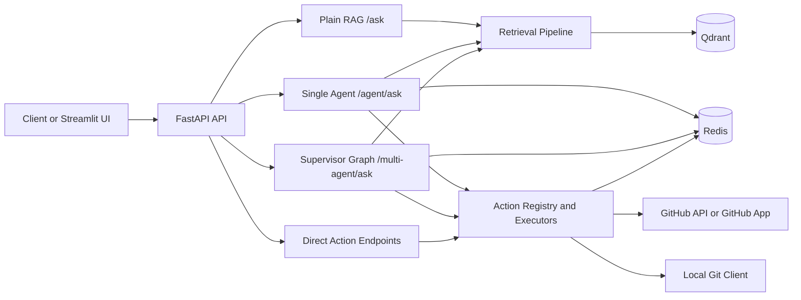

# Architecture

## System Overview

This repository is a local-first internal support copilot with three serving modes:

- `POST /ask`: plain retrieval-augmented generation (RAG)
- `POST /agent/ask`: single-agent orchestration with routing, short-term memory, and guarded chat actions
- `POST /multi-agent/ask`: LangGraph supervisor that routes work across multiple retrieval sub-agents before synthesis

All three modes share the same core retrieval and answer-generation building blocks. Write-capable operations such as creating GitHub issues or local commits are kept outside the normal retrieval path and run through an explicit action layer.

## Major Modules

| Module | Responsibility |
| --- | --- |
| `src/api` | FastAPI entrypoints, request validation, auth checks, health/readiness, and response models |
| `src/core` | Cross-cutting concerns such as settings, auth, runtime validation, logging, observability, and security helpers |
| `src/pipeline.py` | Shared RAG pipeline: retrieve documents, build prompt, call the local LLM, and format sources |
| `src/rag` | Ingestion, chunking, indexing, retrieval, reranking, and answer-generation helpers |
| `src/agent` | Single-agent behavior, route config, route scoring, chat action detection, guardrails, and write-action orchestration |
| `src/agent/graph` | LangGraph supervisor, domain subgraphs, merge logic, and final synthesis for multi-agent mode |
| `src/persistence` | Swappable persistence for session history, pending confirmations, action records, and graph checkpoints |
| `src/integrations` | External system boundaries such as GitHub and local git execution |
| `src/ui` | Streamlit UI for local operator use |

## Request Flow

### `POST /ask`

1. `src/api/main.py` validates the request and resolves the shared pipeline.
2. `src/pipeline.py` calls `retrieve_documents(...)`.
3. The pipeline builds a prompt from retrieved documents and invokes the local LLM.
4. The API returns an answer plus normalized sources and optional debug data.

### `POST /agent/ask`

1. The API resolves auth context and request correlation data.
2. Chat input is checked for a write-capable intent before normal retrieval runs.
3. If no action is requested, the single-agent service loads session history, optionally rewrites follow-up questions, and decides between:
   - `clarify`
   - `retrieve_only`
   - `answer_from_kb`
4. Answer mode performs a retrieval preflight, runs guardrails, and only then synthesizes the final answer.

### `POST /multi-agent/ask`

1. The API applies the same auth and chat-action precheck used by single-agent mode.
2. Session history is prepared and passed into the supervisor graph.
3. The supervisor route node selects one or more domain agents such as `github_docs`, `gitlab`, or `issues`.
4. Selected subgraphs retrieve evidence in separate graph branches.
5. Results are merged, deduplicated, and synthesized into one answer.

### `POST /multi-agent/actions/*`

1. The API enforces operator permissions.
2. The action registry maps the request to a known executor.
3. The executor creates or reuses an action record, applies idempotency checks, and calls the integration client.
4. The result is returned as an `AgentResponse` with action metadata in `stats`.

## Retrieval Flow

The retrieval layer is shared by plain RAG and reused by the agent layers.

1. `src/rag/retrieval/retriever.py` performs a Qdrant similarity search to get an initial candidate set.
2. A small intent-specific prefilter can trim obviously irrelevant candidates for certain query types.
3. Candidates go through heuristic reranking.
4. If hierarchical data is available, leaf results can be merged with parent documents.
5. The merged set is reranked again.
6. If enabled, a cross-encoder performs the final rerank.
7. Results are deduplicated by origin document before being returned.
8. `src/pipeline.py` builds a prompt from those documents and calls the local LLM.

In multi-agent mode, each domain subgraph produces retrieval results in the same shape so the supervisor can merge them before synthesis.

## Action Flow

Write-capable actions currently include:

- creating a GitHub repository
- creating a GitHub issue
- creating a local git commit

The action path is intentionally separate from the answer path:

1. `src/agent/action_registry.py` detects action requests from chat or dispatches a direct action by name.
2. `src/agent/chat_actions.py` decides whether to clarify, request confirmation, cancel, replay an existing action, or execute.
3. `src/agent/actions.py` manages the durable action record and status transitions.
4. `src/integrations/github_client.py` or `src/integrations/local_git_client.py` performs the side effect.
5. The response includes audit-friendly fields such as `action_id`, `idempotency_key`, and the final action status.

## Safety And Confirmation Flow

The project uses a lightweight operational safety boundary rather than trying to hide side effects behind normal chat answers.

1. Authorization is enforced at the API boundary in `src/core/auth.py`.
   Read-only requests can run as `viewer`; write-capable requests require `operator`.
2. Potential write requests are detected before retrieval-heavy work starts.
3. If confirmation is required, the system stores pending confirmation state in the session store and a matching action record in the action store.
4. Action records use explicit statuses: `pending`, `confirmed`, `running`, `succeeded`, `failed`, `cancelled`.
5. Repeated requests with the same idempotency key do not rerun the side effect. They replay the prior result or report that the action is already in progress.
6. Server logs keep detailed failure data, while API responses stay sanitized and avoid exposing secrets.

Redis-backed persistence is the default durable option for session state, action records, and graph checkpoints. Memory backends still exist for local-only development.

## External Dependencies

| Dependency | Role | Required |
| --- | --- | --- |
| Qdrant | Vector store for indexed knowledge and retrieval | Yes for retrieval and ingestion |
| Redis | Persistent session state, pending confirmations, action records, and graph checkpoints | Recommended; can be replaced with in-memory backends for local-only runs |
| Local LLM and Hugging Face models | Answer generation, embeddings, and optional reranking | Yes for real answer generation |
| GitHub API and GitHub App credentials | Repository and issue write actions | Optional |
| Local git repository and git executable | Local commit action | Optional |
| Docker Compose | Convenient local infrastructure startup for Qdrant and Redis | Optional |

## Extension Notes

- Add or change route behavior in `src/agent/route_config.py` and `src/agent/router.py`.
- Add new write actions through `src/agent/action_registry.py` and `src/agent/actions.py`.
- Change persistence backends in `src/persistence`.
- See `docs/ROUTING.md`, `docs/ACTIONS.md`, and `docs/PERSISTENCE.md` for extension details.
