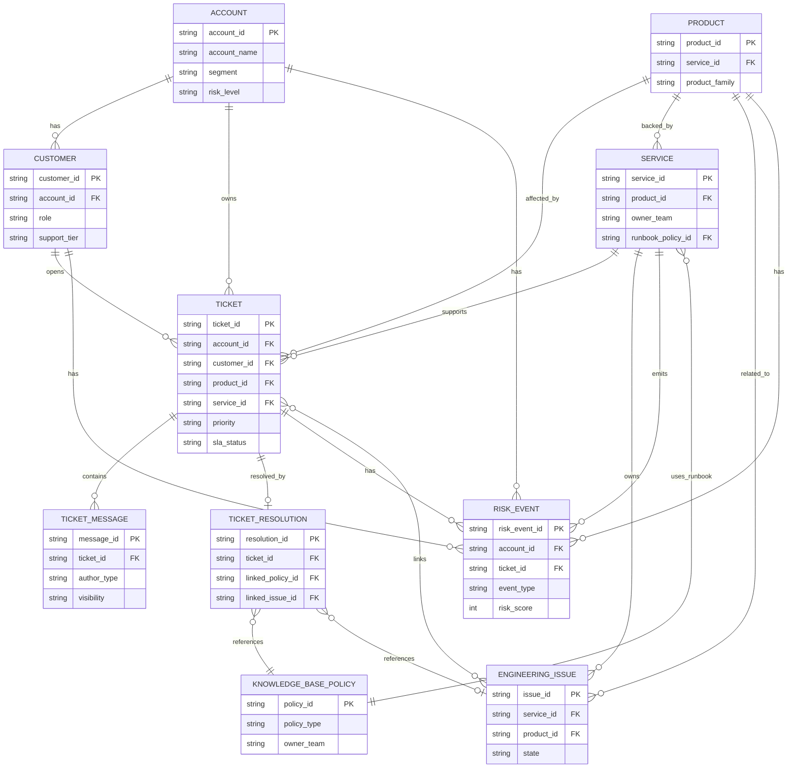

# Enterprise Support Data Model

## Domain Overview

This data model upgrades the project from a GitHub-centered support copilot into an Enterprise Support Intelligence Copilot. The dataset is synthetic-only and should live under:

```text
data/sample_enterprise_support/
```

The model is intentionally small, stable, and easy to ingest into RAG, a future Knowledge Graph, and customer intelligence workflows. It represents six enterprise support domains:

- `crm/`: synthetic customers, accounts, and purchased products.
- `support/`: tickets, ticket messages, and final resolutions.
- `knowledge_base/`: policy and troubleshooting documents.
- `engineering/`: service ownership and GitHub-like engineering issue evidence.
- `risk/`: customer, account, product, service, and ticket risk events.
- Derived indexes: vector chunks, graph nodes, route metadata, and evaluation cases built from the source data.

No private, proprietary, or real customer data should be used. All names, domains, tickets, events, and messages must be synthetic.

## Repository Location

Planned dataset layout:

```text
data/sample_enterprise_support/
  crm/
    customers.csv
    accounts.csv
    products.csv
  support/
    tickets.csv
    ticket_messages.csv
    ticket_resolutions.csv
  knowledge_base/
    sla_policy.md
    access_policy.md
    refund_policy.md
    api_timeout_runbook.md
    login_troubleshooting.md
    security_escalation_policy.md
    incident_response_policy.md
    enterprise_support_policy.md
    customer_risk_policy.md
    data_retention_policy.md
  engineering/
    service_catalog.csv
    github_issues.jsonl
  risk/
    risk_events.csv
```

## Entity Descriptions

| Entity | File | Description |
| --- | --- | --- |
| Customer | `crm/customers.csv` | Synthetic individual contact associated with an account. |
| Account | `crm/accounts.csv` | Synthetic company or organization receiving support. |
| Product | `crm/products.csv` | Product or plan purchased or used by an account. |
| Ticket | `support/tickets.csv` | Support case opened by a customer for a product or service. |
| Ticket Message | `support/ticket_messages.csv` | Chronological conversation events for a ticket. |
| Ticket Resolution | `support/ticket_resolutions.csv` | Final or latest resolution summary for a ticket. |
| Knowledge Base Policy | `knowledge_base/*.md` | Policy, troubleshooting, or runbook document with stable metadata. |
| Service | `engineering/service_catalog.csv` | Engineering-owned service that can be linked to tickets, products, and issues. |
| Engineering Issue | `engineering/github_issues.jsonl` | Synthetic GitHub-like issue evidence tied to services and support cases. |
| Risk Event | `risk/risk_events.csv` | Signal describing SLA, incident, account, security, retention, or anomaly risk. |

## Field-Level Schemas

### `crm/customers.csv`

| Field | Type | Required | Description |
| --- | --- | --- | --- |
| `customer_id` | string | Yes | Stable customer identifier, for example `cust_001`. |
| `account_id` | string | Yes | Foreign key to `accounts.account_id`. |
| `full_name` | string | Yes | Synthetic contact name. |
| `email` | string | Yes | Synthetic email using safe domains such as `example.com`. |
| `role` | string | Yes | Customer role, for example `admin`, `developer`, `billing_owner`, or `executive_sponsor`. |
| `region` | string | Yes | Broad region such as `NA`, `EMEA`, `APAC`, or `LATAM`. |
| `timezone` | string | No | IANA-like timezone string for support context. |
| `created_at` | datetime | Yes | ISO 8601 timestamp when the synthetic customer was created. |
| `status` | string | Yes | `active`, `inactive`, or `trial`. |
| `support_tier` | string | Yes | `standard`, `premium`, or `enterprise`. |
| `preferred_contact_channel` | string | No | `email`, `portal`, `slack`, or `phone`. |

### `crm/accounts.csv`

| Field | Type | Required | Description |
| --- | --- | --- | --- |
| `account_id` | string | Yes | Stable account identifier, for example `acct_001`. |
| `account_name` | string | Yes | Synthetic company name. |
| `industry` | string | Yes | Synthetic industry category. |
| `segment` | string | Yes | `startup`, `mid_market`, `enterprise`, or `strategic`. |
| `region` | string | Yes | Primary region for support and SLA analysis. |
| `account_owner` | string | No | Synthetic internal owner or team alias. |
| `contract_start_date` | date | No | ISO date. |
| `contract_end_date` | date | No | ISO date. |
| `arr_usd` | integer | No | Synthetic annual recurring revenue value. |
| `health_score` | integer | No | 0 to 100 customer health score. |
| `risk_level` | string | Yes | `low`, `medium`, `high`, or `critical`. |
| `created_at` | datetime | Yes | ISO 8601 timestamp. |

### `crm/products.csv`

| Field | Type | Required | Description |
| --- | --- | --- | --- |
| `product_id` | string | Yes | Stable product identifier, for example `prod_api`. |
| `product_name` | string | Yes | Product display name. |
| `product_family` | string | Yes | Higher-level grouping such as `platform`, `identity`, or `billing`. |
| `service_id` | string | No | Primary service backing the product, foreign key to `service_catalog.service_id`. |
| `plan_name` | string | No | Plan or package name. |
| `lifecycle_stage` | string | Yes | `beta`, `ga`, `deprecated`, or `retired`. |
| `support_owner_team` | string | No | Team responsible for support escalation. |
| `engineering_owner_team` | string | No | Team responsible for engineering escalation. |
| `docs_url` | string | No | Synthetic or local documentation URL. |

### `support/tickets.csv`

| Field | Type | Required | Description |
| --- | --- | --- | --- |
| `ticket_id` | string | Yes | Stable ticket identifier, for example `tkt_001`. |
| `account_id` | string | Yes | Foreign key to `accounts.account_id`. |
| `customer_id` | string | Yes | Foreign key to `customers.customer_id`. |
| `product_id` | string | Yes | Foreign key to `products.product_id`. |
| `service_id` | string | No | Foreign key to `service_catalog.service_id` if known. |
| `title` | string | Yes | Short ticket title. |
| `description` | string | Yes | Synthetic issue description. |
| `category` | string | Yes | `technical`, `billing`, `access`, `security`, `incident`, or `how_to`. |
| `priority` | string | Yes | `p1`, `p2`, `p3`, or `p4`. |
| `severity` | string | No | `sev1`, `sev2`, `sev3`, or `sev4`. |
| `status` | string | Yes | `open`, `pending_customer`, `pending_engineering`, `resolved`, or `closed`. |
| `channel` | string | No | `email`, `portal`, `slack`, `phone`, or `chat`. |
| `created_at` | datetime | Yes | ISO 8601 timestamp. |
| `updated_at` | datetime | Yes | ISO 8601 timestamp. |
| `first_response_due_at` | datetime | No | SLA first response deadline. |
| `resolution_due_at` | datetime | No | SLA resolution deadline. |
| `sla_status` | string | Yes | `within_sla`, `at_risk`, `breached`, or `not_applicable`. |
| `assigned_team` | string | No | Support team currently assigned. |
| `assignee` | string | No | Synthetic support owner. |
| `tags` | string | No | Pipe-delimited tags such as `login|sso|enterprise`. |

### `support/ticket_messages.csv`

| Field | Type | Required | Description |
| --- | --- | --- | --- |
| `message_id` | string | Yes | Stable message identifier. |
| `ticket_id` | string | Yes | Foreign key to `tickets.ticket_id`. |
| `author_type` | string | Yes | `customer`, `support`, `engineering`, or `system`. |
| `author_id` | string | No | `customer_id`, synthetic staff id, or system id. |
| `created_at` | datetime | Yes | ISO 8601 timestamp. |
| `visibility` | string | Yes | `public` or `internal`. |
| `message_type` | string | Yes | `question`, `reply`, `note`, `status_change`, or `handoff`. |
| `body` | string | Yes | Synthetic message body. |
| `sentiment` | string | No | `positive`, `neutral`, `frustrated`, or `urgent`. |
| `contains_action_item` | boolean | No | Whether the message contains a requested follow-up. |

### `support/ticket_resolutions.csv`

| Field | Type | Required | Description |
| --- | --- | --- | --- |
| `resolution_id` | string | Yes | Stable resolution identifier. |
| `ticket_id` | string | Yes | Foreign key to `tickets.ticket_id`. |
| `resolved_at` | datetime | No | ISO 8601 timestamp when resolved. |
| `resolution_type` | string | Yes | `answered`, `workaround`, `bug_fix`, `configuration_change`, `duplicate`, or `not_reproducible`. |
| `summary` | string | Yes | Concise synthetic resolution summary. |
| `root_cause` | string | No | Synthetic root cause. |
| `linked_policy_id` | string | No | Foreign key to a knowledge base `policy_id`. |
| `linked_issue_id` | string | No | Foreign key to `github_issues.issue_id`. |
| `customer_visible_response` | string | No | Final customer-safe response text. |
| `preventive_action` | string | No | Suggested prevention or follow-up action. |

### `knowledge_base/*.md`

Each Markdown file should contain policy or runbook content and a small YAML front matter block. The stable ID for these files is `policy_id`.

Recommended front matter:

| Field | Type | Required | Description |
| --- | --- | --- | --- |
| `policy_id` | string | Yes | Stable policy identifier, for example `pol_sla`. |
| `title` | string | Yes | Human-readable policy or runbook title. |
| `policy_type` | string | Yes | `policy`, `runbook`, `troubleshooting`, or `procedure`. |
| `product_id` | string | No | Related product, if the document is product-specific. |
| `service_id` | string | No | Related service, if the document is service-specific. |
| `owner_team` | string | Yes | Team that owns the document. |
| `effective_date` | date | No | ISO date when guidance became active. |
| `review_date` | date | No | ISO date for future review. |
| `tags` | list[string] | No | Search and routing tags. |
| `summary` | string | Yes | Short description used for retrieval previews. |

Planned Markdown files:

| File | Recommended `policy_id` | Purpose |
| --- | --- | --- |
| `sla_policy.md` | `pol_sla` | SLA tiers, response targets, and escalation thresholds. |
| `access_policy.md` | `pol_access` | Access requests, approvals, and customer admin responsibilities. |
| `refund_policy.md` | `pol_refund` | Refund eligibility and support handoff rules. |
| `api_timeout_runbook.md` | `pol_api_timeout` | API timeout diagnosis and escalation procedure. |
| `login_troubleshooting.md` | `pol_login_troubleshooting` | Common login and SSO troubleshooting steps. |
| `security_escalation_policy.md` | `pol_security_escalation` | Handling suspected security incidents. |
| `incident_response_policy.md` | `pol_incident_response` | Incident declaration, roles, and customer communications. |
| `enterprise_support_policy.md` | `pol_enterprise_support` | Enterprise support coverage and engagement model. |
| `customer_risk_policy.md` | `pol_customer_risk` | Customer risk scoring and escalation guidance. |
| `data_retention_policy.md` | `pol_data_retention` | Synthetic retention and deletion policy for support records. |

### `engineering/service_catalog.csv`

| Field | Type | Required | Description |
| --- | --- | --- | --- |
| `service_id` | string | Yes | Stable service identifier, for example `svc_auth`. |
| `service_name` | string | Yes | Service display name. |
| `description` | string | Yes | Short service description. |
| `product_id` | string | No | Related product, foreign key to `products.product_id`. |
| `owner_team` | string | Yes | Engineering owner team. |
| `support_escalation_team` | string | Yes | Support team for escalations. |
| `tier` | string | Yes | Operational tier such as `tier_0`, `tier_1`, or `tier_2`. |
| `slack_channel` | string | No | Synthetic team channel. |
| `runbook_policy_id` | string | No | Foreign key to a knowledge base `policy_id`. |
| `on_call_rotation` | string | No | Synthetic on-call rotation name. |
| `repo` | string | No | Synthetic repository name. |
| `status` | string | Yes | `active`, `maintenance`, `deprecated`, or `retired`. |

### `engineering/github_issues.jsonl`

One JSON object per line.

| Field | Type | Required | Description |
| --- | --- | --- | --- |
| `issue_id` | string | Yes | Stable engineering issue identifier, for example `gh_001`. |
| `repo` | string | Yes | Synthetic repository name. |
| `number` | integer | Yes | Synthetic issue number. |
| `title` | string | Yes | Issue title. |
| `body` | string | Yes | Synthetic issue body. |
| `state` | string | Yes | `open` or `closed`. |
| `labels` | list[string] | No | Labels such as `bug`, `incident`, `auth`, or `customer-impacting`. |
| `service_id` | string | No | Foreign key to `service_catalog.service_id`. |
| `product_id` | string | No | Foreign key to `products.product_id`. |
| `linked_ticket_ids` | list[string] | No | Related support ticket IDs. |
| `severity` | string | No | `sev1`, `sev2`, `sev3`, or `sev4`. |
| `created_at` | datetime | Yes | ISO 8601 timestamp. |
| `updated_at` | datetime | Yes | ISO 8601 timestamp. |
| `closed_at` | datetime | No | ISO 8601 timestamp if closed. |
| `assignee_team` | string | No | Engineering team responsible for the issue. |
| `resolution_summary` | string | No | Customer-safe summary when resolved. |

### `risk/risk_events.csv`

| Field | Type | Required | Description |
| --- | --- | --- | --- |
| `risk_event_id` | string | Yes | Stable risk event identifier, for example `risk_001`. |
| `account_id` | string | No | Foreign key to `accounts.account_id`. |
| `customer_id` | string | No | Foreign key to `customers.customer_id`. |
| `ticket_id` | string | No | Foreign key to `tickets.ticket_id`. |
| `product_id` | string | No | Foreign key to `products.product_id`. |
| `service_id` | string | No | Foreign key to `service_catalog.service_id`. |
| `event_type` | string | Yes | `sla_breach`, `incident`, `security`, `churn_risk`, `usage_anomaly`, or `sentiment_drop`. |
| `severity` | string | Yes | `low`, `medium`, `high`, or `critical`. |
| `risk_score` | integer | Yes | 0 to 100 synthetic risk score. |
| `detected_at` | datetime | Yes | ISO 8601 timestamp. |
| `source` | string | Yes | `support`, `crm`, `engineering`, `system`, or `manual_review`. |
| `summary` | string | Yes | Short explanation of the signal. |
| `evidence_refs` | string | No | Pipe-delimited references to tickets, policies, or issues. |
| `recommended_action` | string | No | Suggested next step. |
| `status` | string | Yes | `open`, `acknowledged`, `mitigated`, or `closed`. |

## Relationships

- One `Account` has many `Customers`.
- One `Account` has many `Tickets`.
- One `Customer` can open many `Tickets`.
- One `Product` can be linked to many `Tickets`, `Services`, policies, and issues.
- One `Service` can support one or more products and can be linked to many tickets, policies, GitHub issues, and risk events.
- One `Ticket` has many `Ticket Messages`.
- One `Ticket` has zero or one primary `Ticket Resolution`.
- One `Ticket Resolution` can reference one knowledge base policy and one engineering issue.
- One `Knowledge Base Policy` can guide many tickets, resolutions, services, and risk events.
- One `Engineering Issue` can link to many support tickets.
- One `Risk Event` can reference an account, customer, ticket, product, service, and supporting evidence.

## Mermaid ER Diagram



## How The Data Supports AI Workflows

### RAG

- Knowledge base Markdown files become high-quality retrieval documents for policy and runbook questions.
- Tickets, messages, resolutions, and GitHub issues provide historical evidence for similar-case retrieval.
- CRM and service metadata can be attached to chunks as filterable metadata, for example `account_id`, `product_id`, `service_id`, `priority`, `sla_status`, and `risk_level`.
- The existing vector store can index normalized documents while preserving stable source IDs for citations.

### Knowledge Graph

- Stable IDs make it possible to create graph nodes for accounts, customers, products, tickets, services, policies, issues, and risk events.
- Foreign keys define graph edges such as `OPENED_TICKET`, `AFFECTS_SERVICE`, `REFERENCES_POLICY`, `LINKS_ISSUE`, and `HAS_RISK_EVENT`.
- GraphRAG can combine vector evidence with explicit relationships, for example retrieving a ticket, then expanding to the account, product, service owner, runbook, and related engineering issue.

### CRM Intelligence

- Account health, risk level, support tier, segment, ARR, and ticket history support customer summaries.
- Customer role and preferred channel help tailor responses.
- Account-level risk events make it possible to explain customer health changes from support and incident evidence.

### Customer Support Automation

- Tickets and messages support triage, summarization, reply drafting, and follow-up detection.
- SLA fields support escalation checks and deadline-aware recommendations.
- Resolutions and linked policies support grounded support responses with reusable evidence.

### Risk And Anomaly Detection

- Risk events provide supervised examples for explaining SLA breaches, incidents, usage anomalies, churn risk, sentiment drops, and security concerns.
- Ticket volume, severity, status, sentiment, and risk score fields can be aggregated per account, product, or service.
- Future scoring can remain explainable by linking each risk event to source tickets, policies, incidents, and engineering issues.

### AI System Integration

- Stable IDs support deterministic ingestion, deduplication, citations, tests, and replayable evaluations.
- The model cleanly separates source data from derived RAG chunks and graph projections.
- Metadata fields can drive agent routing, source filters, access control checks, and evaluation slices.
- The schema is additive, so new enterprise domains can be introduced without replacing the existing GitHub ingestion pipeline.
